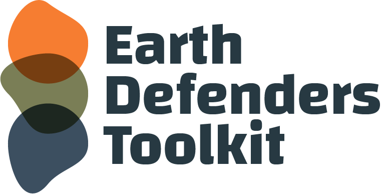
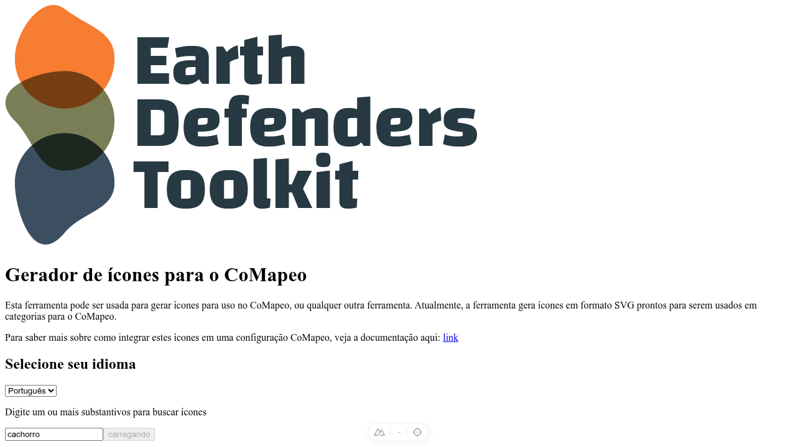

<a id="readme-top"></a>

<!-- PROJECT LOGO -->
<br />
<div align="center">
  

  <h1>CoMapeo Icons</h1>

  <p align="center">
    Search, colorize, and export SVG icons for <a href="https://comapeo.app/">CoMapeo</a> configurations.
    <br />
    Translate search terms into 7 languages, find icons across multiple providers, recolor them on the fly, and download ready-to-use SVG data URIs.
    <br />
    <br />
    <a href="http://icons.earthdefenderstoolkit.com/"><strong>Live Demo</strong></a>
    &middot;
    <a href="https://github.com/digidem/mapeo-icons/issues/new?labels=bug&template=bug-report.md">Report Bug</a>
    &middot;
    <a href="https://github.com/digidem/mapeo-icons/issues/new?labels=enhancement&template=feature-request.md">Request Feature</a>
  </p>
</div>

<!-- BADGES -->
<div align="center">

[![CI][ci-shield]][ci-url]
[![Docker][docker-shield]][docker-url]
[![Node.js][node-shield]][node-url]
[![Nuxt][nuxt-shield]][nuxt-url]
[![License][license-shield]][license-url]
[![Contributors][contributors-shield]][contributors-url]

</div>

<br />

<!-- TABLE OF CONTENTS -->
<details>
  <summary>Table of Contents</summary>
  <ol>
    <li><a href="#about">About</a></li>
    <li><a href="#features">Features</a></li>
    <li><a href="#screenshots">Screenshots</a></li>
    <li><a href="#built-with">Built With</a></li>
    <li><a href="#related-tooling">Related Tooling</a></li>
    <li><a href="#getting-started">Getting Started</a>
      <ul>
        <li><a href="#prerequisites">Prerequisites</a></li>
        <li><a href="#installation">Installation</a></li>
      </ul>
    </li>
    <li><a href="#usage">Usage</a></li>
    <li><a href="#environment-variables">Environment Variables</a></li>
    <li><a href="#project-structure">Project Structure</a></li>
    <li><a href="#development">Development</a>
      <ul>
        <li><a href="#scripts">Scripts</a></li>
        <li><a href="#testing">Testing</a></li>
        <li><a href="#linting">Linting</a></li>
      </ul>
    </li>
    <li><a href="#deployment">Deployment</a>
      <ul>
        <li><a href="#docker">Docker</a></li>
        <li><a href="#docker-compose">Docker Compose</a></li>
      </ul>
    </li>
    <li><a href="#internationalization">Internationalization</a></li>
    <li><a href="#how-it-works">How It Works</a></li>
    <li><a href="#contributing">Contributing</a></li>
    <li><a href="#license">License</a></li>
    <li><a href="#acknowledgments">Acknowledgments</a></li>
  </ol>
</details>

---

## About

CoMapeo Icons is a web application that bridges the gap between finding the right icon and having it ready for use in [CoMapeo](https://comapeo.app/) configurations. It enables communities — especially those working in environmental monitoring and indigenous land rights — to create visually meaningful, color-customized icons without needing design tools or technical expertise.

The app searches across multiple icon providers (Iconify, The Noun Project), automatically translates search terms into the user's language, applies custom colors via an interactive color picker, and exports optimized SVG data URIs that drop directly into CoMapeo configuration files.

<p align="right">(<a href="#readme-top">back to top</a>)</p>

## Features

- **Multi-provider icon search** — Searches Iconify by default (200K+ icons, no API key needed), with The Noun Project as a configurable fallback. Provider order is customizable.
- **Automatic translation** — Search terms are translated via Bing Translate so users can search in their native language across 7 locales.
- **Live color customization** — Interactive color picker with real-time preview. Icons are recolored using CSS filter generation (SPSA optimization algorithm) and SVG paint attribute replacement.
- **SVG optimization** — Icons are processed through SVGO for minification and converted to data URIs via `mini-svg-data-uri`.
- **PNG-to-SVG tracing** — Raster icons from The Noun Project are automatically traced to vector SVG using Potrace.
- **One-click download & copy** — Download as `.svg` file or copy SVG markup / data URI directly to clipboard.
- **Fully internationalized** — UI available in English, Portuguese, Spanish, Thai, Dutch, French, and Indonesian with automatic browser language detection.
- **Mobile-first responsive design** — Optimized for field use on phones and tablets.
- **Docker-ready** — Multi-arch images (amd64 + arm64) published to Docker Hub on every successful CI run.

<p align="right">(<a href="#readme-top">back to top</a>)</p>

## Screenshots

<div align="center">
  <table>
    <tr>
      <td align="center"><b>Search Home</b></td>
      <td align="center"><b>Icon Selection + Color Picker</b></td>
    </tr>
    <tr>
      <td></td>
      <td></td>
    </tr>
    <tr>
      <td align="center" colspan="2"><b>Mobile Color Picker</b></td>
    </tr>
    <tr>
      <td align="center" colspan="2"></td>
    </tr>
  </table>
</div>

<p align="right">(<a href="#readme-top">back to top</a>)</p>

## Built With

<div align="center">

[![Nuxt][nuxt-shield]][nuxt-url]
[![Vue.js][vue-shield]][vue-url]
[![TypeScript][typescript-shield]][typescript-url]
[![Tailwind CSS][tailwind-shield]][tailwind-url]
[![Playwright][playwright-shield]][playwright-url]
[![Docker][docker-shield]][docker-url]

</div>

| Technology                                                                                             | Purpose                                             |
| ------------------------------------------------------------------------------------------------------ | --------------------------------------------------- |
| [Nuxt 4](https://nuxt.com)                                                                             | Full-stack Vue framework (SSR + Nitro server)       |
| [Vue 3](https://vuejs.org)                                                                             | Reactive UI components (`<script setup lang="ts">`) |
| [Tailwind CSS](https://tailwindcss.com)                                                                | Utility-first styling                               |
| [Playwright](https://playwright.dev)                                                                   | End-to-end testing                                  |
| [SVGO](https://github.com/svg/svgo)                                                                    | SVG optimization                                    |
| [Potrace](https://github.com/tofolkmann/potrace)                                                       | Raster-to-vector tracing                            |
| [bing-translate-api](https://github.com/plainheart/bing-translate-api)                                 | Search term translation                             |
| [Husky](https://typicode.github.io/husky/) + [lint-staged](https://github.com/lint-staged/lint-staged) | Git hooks & pre-commit linting                      |

<p align="right">(<a href="#readme-top">back to top</a>)</p>

## Related Tooling

[CoMapeo Category Set Spreadsheet Plugin](https://github.com/digidem/comapeo-category-spreadsheet-plugin) is commonly used with CoMapeo Icons. It generates `.comapeocat` category files from Google Sheets and can use icons produced by this tool for CoMapeo projects.

<p align="right">(<a href="#readme-top">back to top</a>)</p>

## Getting Started

### Prerequisites

- **Node.js** >= 22.18.0
- **npm** (comes with Node.js)

### Installation

1. Clone the repository

   ```bash
   git clone https://github.com/digidem/mapeo-icons.git
   cd mapeo-icons
   ```

2. Install dependencies

   ```bash
   npm install
   ```

3. Set up environment variables

   ```bash
   cp .env.example .env
   ```

   Iconify works out of the box with no credentials. Only add The Noun Project keys if you want it as a fallback provider.

4. Start the development server

   ```bash
   npm run dev
   ```

5. Visit `http://localhost:3000` and start searching.

<p align="right">(<a href="#readme-top">back to top</a>)</p>

## Usage

1. **Search** — Enter a term in any of the 7 supported languages. The app translates it to English before querying icon providers.
2. **Browse** — Scroll through results and click an icon to select it. Use "Load more" for additional results.
3. **Colorize** — Pick a color using the color picker. Icons update in real-time.
4. **Generate** — Click "Generate" to process the icon through SVGO optimization and color replacement.
5. **Export** — Download the `.svg` file or copy the SVG markup / data URI to your clipboard.

The generated SVG data URIs are ready to paste directly into a [CoMapeo configuration](https://docs.comapeo.app/).

<p align="right">(<a href="#readme-top">back to top</a>)</p>

## Environment Variables

All variables are optional — the app works with zero configuration using Iconify defaults.

| Variable               | Required | Default                                                       | Description                                               |
| ---------------------- | -------- | ------------------------------------------------------------- | --------------------------------------------------------- |
| `ICONS_TO_DOWNLOAD`    | No       | `10`                                                          | Number of icons to fetch per request                      |
| `ICON_PROVIDER_ORDER`  | No       | `noun,iconify`                                                | Comma-separated provider order                            |
| `ICONIFY_API_BASE_URL` | No       | `https://api.iconify.design`                                  | Iconify API base URL                                      |
| `ICONIFY_PREFIXES`     | No       | `maki,temaki,material-symbols,mdi,tabler,ph,lucide,heroicons` | Comma-separated Iconify icon collections                  |
| `NOUN_KEY`             | No       | —                                                             | The Noun Project OAuth consumer key                       |
| `NOUN_SECRET`          | No       | —                                                             | The Noun Project OAuth consumer secret                    |
| `CORS`                 | No       | —                                                             | Set to `all` or a comma-separated list of allowed origins |

Restart the dev server after changing any of these values.

<p align="right">(<a href="#readme-top">back to top</a>)</p>

## Project Structure

```
mapeo-icons/
├── assets/
│   └── main.css              # Global Tailwind imports
├── components/
│   ├── ColorPickerMobile.vue  # Collapsible mobile color picker
│   ├── Footer.vue             # Page footer
│   └── Search.vue             # Search form + locale selector
├── libs/
│   └── colorize.js            # CSS filter generator (SPSA algorithm)
├── locales/                   # i18n translation bundles (7 languages)
├── pages/
│   ├── index.vue              # Landing page / search
│   ├── images.vue             # Icon grid + color selection
│   └── result.vue             # Final SVG output + download/copy
├── public/
│   ├── favicon.ico
│   ├── icon.png
│   ├── logo.webp
│   └── sw.js                  # Service worker
├── server/
│   ├── api/
│   │   ├── search.get.ts      # GET /api/search — icon search endpoint
│   │   └── generate.get.ts    # GET /api/generate — SVG generation endpoint
│   └── utils/
│       ├── iconSearch.ts      # Multi-provider search logic
│       ├── generateMapeoIcon.ts # SVG colorization + optimization
│       └── translate.ts       # Bing Translate wrapper
├── store/
│   └── README.md              # State management notes
├── tests/
│   └── e2e/
│       ├── search.spec.ts     # Search flow tests
│       ├── color-picker.spec.ts # Color picker tests
│       └── screenshots/       # Test artifacts
├── types/                     # TypeScript shims
├── Dockerfile                 # Production container definition
├── nuxt.config.js             # Nuxt configuration
├── tailwind.config.ts         # Tailwind theme
└── playwright.config.ts       # E2E test configuration
```

<p align="right">(<a href="#readme-top">back to top</a>)</p>

## Development

### Scripts

| Command               | Description                                               |
| --------------------- | --------------------------------------------------------- |
| `npm run dev`         | Start the Vite-powered Nuxt dev server (`localhost:3000`) |
| `npm run build`       | Compile the production bundle                             |
| `npm run preview`     | Serve the built Nitro output locally                      |
| `npm run generate`    | Pre-render the app as static files                        |
| `npm test`            | Run Playwright E2E suite (headless, port 4173)            |
| `npm run test:headed` | Run tests in headed browser mode                          |
| `npm run test:ui`     | Run tests in Playwright UI mode                           |
| `npm run lint`        | Run ESLint + Stylelint + Prettier checks                  |
| `npm run lintfix`     | Autofix lint issues and format all files                  |

### Testing

End-to-end tests use Playwright and model complete user journeys:

```bash
# Run all tests (boots dev server on port 4173)
npm test

# Watch tests in a browser
npm run test:headed

# Interactive UI mode with time travel debugging
npm run test:ui
```

Test artifacts (screenshots) are saved in `tests/e2e/screenshots/`.

### Linting

The project uses ESLint, Stylelint, and Prettier with Husky pre-commit hooks:

```bash
# Check everything
npm run lint

# Auto-fix
npm run lintfix
```

Commits must follow [Conventional Commits](https://www.conventionalcommits.org/) format (enforced by commitlint):

```bash
feat(search): add locale toggle
fix(images): improve color picker accessibility
chore(deps): update nuxt to v4.4.5
```

<p align="right">(<a href="#readme-top">back to top</a>)</p>

## Deployment

### Docker

Pre-built images are published to [Docker Hub](https://hub.docker.com/r/communityfirst/mapeo-icons):

```bash
docker run -d \
  -p 3000:3000 \
  -e NOUN_KEY=your_key \
  -e NOUN_SECRET=your_secret \
  -e ICONS_TO_DOWNLOAD=10 \
  communityfirst/mapeo-icons:latest
```

Images are built for `linux/amd64` and `linux/arm64`. The Docker build pipeline triggers automatically after CI passes on `main`.

### Docker Compose

```yaml
services:
  mapeo-icons:
    image: communityfirst/mapeo-icons:latest
    ports:
      - "3000:3000"
    environment:
      ICONS_TO_DOWNLOAD: 10
      ICON_PROVIDER_ORDER: noun,iconify
      # NOUN_KEY: your_key
      # NOUN_SECRET: your_secret
    restart: unless-stopped
```

<p align="right">(<a href="#readme-top">back to top</a>)</p>

## Internationalization

The app supports 7 languages with automatic browser detection:

| Code | Language         | Flag          |
| ---- | ---------------- | ------------- |
| `en` | English          | :us:          |
| `pt` | Português        | :brazil:      |
| `es` | Español          | :es:          |
| `th` | ไทย              | :thailand:    |
| `nl` | Nederlands       | :netherlands: |
| `fr` | Français         | :fr:          |
| `id` | Bahasa Indonesia | :indonesia:   |

Translation files live in `locales/*.json`. To add a new language, create a new JSON file and register it in `nuxt.config.js` under `i18n.locales`.

<p align="right">(<a href="#readme-top">back to top</a>)</p>

## How It Works

```
User searches "cachorro" (pt)
        │
        ▼
┌─────────────────┐     ┌──────────────────┐
│  Bing Translate  │────▶│  "dog" (en)      │
└─────────────────┘     └────────┬─────────┘
                                 │
                    ┌────────────▼────────────┐
                    │   Provider Chain         │
                    │   (configurable order)   │
                    ├──────────────────────────┤
                    │ 1. The Noun Project      │
                    │    (scrape → API)        │
                    │ 2. Iconify               │
                    │    (8 collections)       │
                    └────────────┬────────────┘
                                 │
                    ┌────────────▼────────────┐
                    │   Icon Results (URLs)    │
                    └────────────┬────────────┘
                                 │
              ┌──────────────────▼──────────────────┐
              │       Generate Endpoint              │
              │  ┌─────────────────────────────────┐ │
              │  │ SVG? → Replace fill/stroke attrs │ │
              │  │ PNG? → Potrace trace to vector   │ │
              │  └──────────────┬──────────────────┘ │
              │                 │                     │
              │  ┌──────────────▼──────────────────┐ │
              │  │ SVGO optimize → data URI         │ │
              │  └──────────────┬──────────────────┘ │
              └─────────────────┼───────────────────┘
                                │
                    ┌───────────▼───────────┐
                    │  Colored SVG download  │
                    │  / clipboard copy      │
                    └───────────────────────┘
```

<p align="right">(<a href="#readme-top">back to top</a>)</p>

## Contributing

Contributions are what make the open source community such an amazing place to learn, inspire, and create. Any contributions you make are **greatly appreciated**.

1. Fork the Project
2. Create your Feature Branch (`git checkout -b feature/amazing-feature`)
3. Commit your Changes (`git commit -m 'feat(scope): add amazing feature'`)
4. Push to the Branch (`git push origin feature/amazing-feature`)
5. Open a Pull Request

### Guidelines

- Follow the existing code style (enforced by ESLint + Prettier + Stylelint)
- Use `<script setup lang="ts">` for Vue components
- Write Conventional Commit messages (`feat(scope): description`)
- Add or update Playwright tests for new features
- Run `npm run lint` and `npm test` before submitting a PR
- Update locale files if you add user-facing strings

### Contributors

<a href="https://github.com/digidem/mapeo-icons/graphs/contributors">
  
</a>

<p align="right">(<a href="#readme-top">back to top</a>)</p>

## License

Distributed under the MIT License. See `LICENSE` for more information.

<p align="right">(<a href="#readme-top">back to top</a>)</p>

## Acknowledgments

- [CoMapeo](https://comapeo.app/) — offline-first mapping for community monitoring
- [Awana](https://awana.digital/) — Digital Democracy's community-centered approach to technology
- [The Noun Project](https://thenounproject.com/) — icon licensing and search
- [Iconify](https://iconify.design/) — open-source icon framework

<p align="right">(<a href="#readme-top">back to top</a>)</p>

---

<!-- MARKDOWN LINKS & IMAGES -->
<!-- https://www.markdownguide.org/basic-syntax/#reference-style-links -->

[ci-shield]: https://img.shields.io/github/actions/workflow/status/digidem/mapeo-icons/test.yml?branch=main&style=for-the-badge&label=CI
[ci-url]: https://github.com/digidem/mapeo-icons/actions/workflows/test.yml
[docker-shield]: https://img.shields.io/badge/Docker-communityfirst%2Fmapeo--icons-blue?style=for-the-badge&logo=docker&logoColor=white
[docker-url]: https://hub.docker.com/r/communityfirst/mapeo-icons
[node-shield]: https://img.shields.io/badge/Node.js->=22.18.0-339933?style=for-the-badge&logo=nodedotjs&logoColor=white
[node-url]: https://nodejs.org/
[nuxt-shield]: https://img.shields.io/badge/Nuxt_4-00DC82?style=for-the-badge&logo=nuxtdotjs&logoColor=white
[nuxt-url]: https://nuxt.com/
[vue-shield]: https://img.shields.io/badge/Vue_3-4FC08D?style=for-the-badge&logo=vuedotjs&logoColor=white
[vue-url]: https://vuejs.org/
[typescript-shield]: https://img.shields.io/badge/TypeScript-3178C6?style=for-the-badge&logo=typescript&logoColor=white
[typescript-url]: https://www.typescriptlang.org/
[tailwind-shield]: https://img.shields.io/badge/Tailwind_CSS-06B6D4?style=for-the-badge&logo=tailwindcss&logoColor=white
[tailwind-url]: https://tailwindcss.com/
[playwright-shield]: https://img.shields.io/badge/Playwright-2EAD33?style=for-the-badge&logo=playwright&logoColor=white
[playwright-url]: https://playwright.dev/
[license-shield]: https://img.shields.io/badge/License-MIT-yellow?style=for-the-badge
[license-url]: https://github.com/digidem/mapeo-icons/blob/main/LICENSE
[contributors-shield]: https://img.shields.io/github/contributors/digidem/mapeo-icons?style=for-the-badge
[contributors-url]: https://github.com/digidem/mapeo-icons/graphs/contributors
